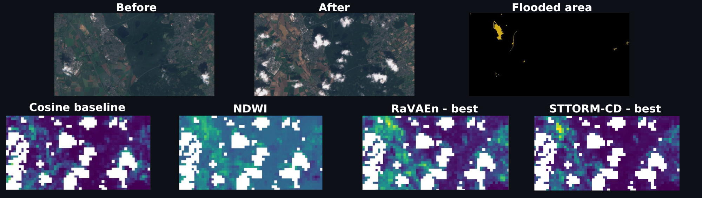

### STTORM-CD

This repository contains code for STTORM-CD research, tested with Python 3.11 and 3.12. To run it successfully, install the dependencies from requirements.txt using pip and execute all scripts from within this repository (i.e., after cloning this repository, run cd STTORM-CD before running any Python scripts). The code is designed with predefined paths for quick setup.
#### Dataset
The **annotated dataset** used for this research can be accessed on **[Zenodo](https://doi.org/10.5281/zenodo.14891438)**. Additionally, the **[RaVAEn](https://github.com/spaceml-org/RaVAEn) dataset** is also used and can be downloaded **[here](https://drive.google.com/drive/folders/1VEf49IDYFXGKcfvMsfh33VSiyx5MpHEn?usp=sharing)**.

After downloading, extract the **Zenodo dataset** into the `data/` directory, ensuring the following structure: `./data/dataset/train/italia_emilia_romagna/1/mask.npy`

For the **RaVAEn dataset**, unzip it into the `data/ravaen/` directory, ensuring the structure is like: `./data/ravaen/floods`

#### Models
Fine-tuned STTORM-CD models are stored as checkpoints in: `models/sttorm_cd_lightning_ckpt`.
RaVAEn models, converted to a compatible format for this code, are saved in: `models/ravaen_modified_ckpt`.

Additionally, the `models/tvm` and `models/onnx` folders contain deployed models following the naming convention:
`change_detection_ModelSize_MarginStrategy_InputShape_TargetDevice`.
Example: `change_detection_large_variable_1_10_32_32_q8_a53.so`.

The `tvm` folder also includes `.py` scripts to measure runtime.
These scripts should be executed on the target device and require the `tvm` library.

#### Training
The models can be trained using `sweep_script.py`, which utilizes Weights and Biases (W&B).
You must set the environment variable `WANDB_API_KEY` to use W&B.
Alternatively, training without W&B is possible using `train_script.py`.
All archived W&B runs are available for transparency at:
https://wandb.ai/jonstr/sttorm_sweep

#### Testing
To test the models, run `testing.py`.
It iterates over all methods and datasets and saves metrics as JSON in:
`attachments/test_metrics_logs`.
You can toggle between generating metrics or heatmaps by modifying the variables
at the top of `DeeperSiameseVae.py`.
Generated heatmaps are saved in `attachments/visualizations`.

#### Attachments (visualizations, tables)

Additional visualizations and tables are available in the `attachments` folder.  
- Tables with all metrics: `attachments/markdown_tables`  
- Recall curve visualizations: `attachments/visualizations_figures/recalls_comparisons`  
- Direct visualizations of model inference results: `attachments/visualizations_figures/direct_visualizations`

For maximum transparency, the folder also includes scripts used to generate the tables and visualizations, as well as scripts for creating and testing ONNX models or cloud masks.

For an in-depth critique of the RaVAEn evaluation, see: 
`attachments/RaVAEn_tile_wise_AUPRC_limitations_showcase.ipynb`. This notebook includes a fictional example from the STTORM-CD Supplementary Information,
illustrating the limitations of using RaVAEn metrics.